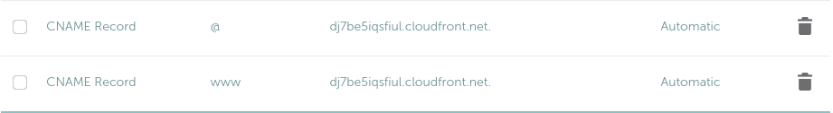
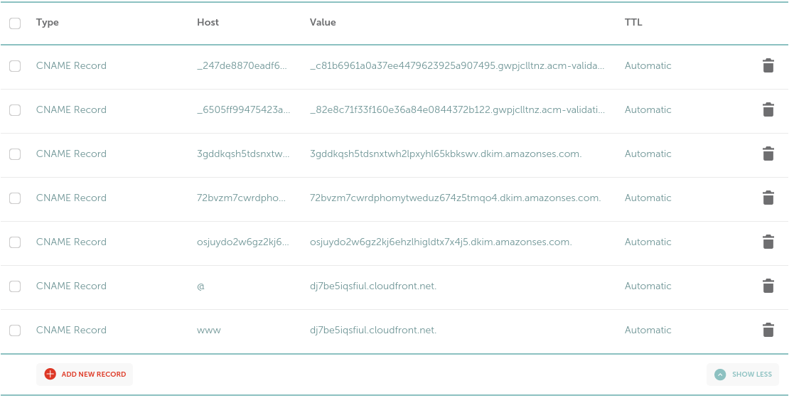
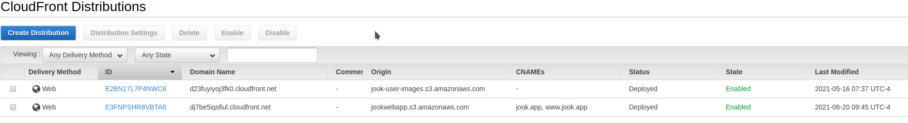
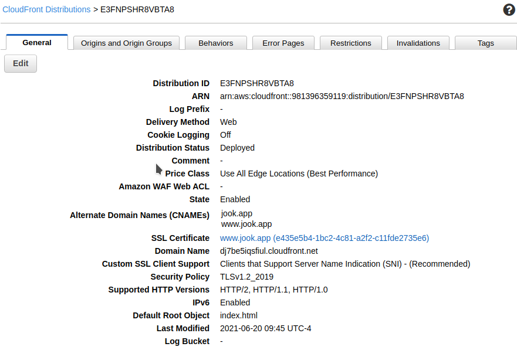

# Hosting a website on AWS using s3 / CloudFront

This will go through running a website where the domain was purchased on `Namecheap`

Some key things I have learned

- the bucket name MUST be DNS
  valid [help](https://docs.rightscale.com/faq/clouds/aws/What_are_valid_S3_bucket_names.html#:~:text=In%20order%20to%20conform%20with,not%20end%20with%20a%20dash)
- In `Namecheap` when adding DNS records do NOT include the domain even if something specifies it is
  needed. [tip](https://www.namecheap.com/support/knowledgebase/article.aspx/317/2237/how-do-i-add-txtspfdkimdmarc-records-for-my-domain/)
- The certificate created in AWS must be created in us-east-2 (US East (N. Virginia))

### Steps

- Create bucket (with dns valid name, example `jookwebapp`)
    - Keep all public access blocked
    - Do NOT need to enable Static website hosting
    - Upload website files
- SSL Certification
    - Go to Certification Manager
    - Request a certification
        - public
    - Add domain names
        - www.jook.app
        - jook.app
    - Dns Validation
    - Copy CNAME records to dns provider
        - Create DNS CNAME records excluding the domain
            - `_247de8870eadf60d95243811ef787139.www.jook.app.` -> `_247de8870eadf60d95243811ef787139.www`
            - `_6505ff99475423a1bcfe5c645cc05b87.jook.app.` -> `_6505ff99475423a1bcfe5c645cc05b87`
- Go to CloudFront Distributions
    - Create Distribution
        - Select bucket that hosts the website
        - Restrict bucket access set to yes
            - Create new identity
            - Update bucket policy
        - Redirect Http to HTTPS
        - Enter alternative domain names
            - www.jook.app
            - jook.app
        - Select the created certificate
        - Create
- Update `Namecheap` to point at CloudFront
    - Create CNAME records that point at CloudFront Domain name (`dj7be5iqsfiul.cloudfront.net`)
      

### Other

- When you update the files in S3 you will likely need to invalidate the caches in CloudFront
  see [this](https://docs.aws.amazon.com/AmazonCloudFront/latest/DeveloperGuide/Invalidation.html)

#### Pics

#### Tutorials Referenced

- [How do I use CloudFront to serve a static website hosted on Amazon S3?](https://aws.amazon.com/premiumsupport/knowledge-center/cloudfront-serve-static-website/)
    - [Video on tutorial](https://www.youtube.com/watch?v=DiIaoIcoKNY&t=139s)
